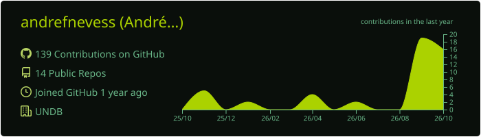

<!-- ===================== BANNER ===================== -->
<p align="center">
  
</p>

<p align="center">
  <a href="https://github.com/andrefnevess">
    
  </a>
</p>

<p align="center">
  <a href="https://portfolioandreneves.vercel.app"></a>
  <a href="https://www.linkedin.com/in/andrefneves/"></a>
  <a href="mailto:andrefneves30@gmail.com"></a>
  
</p>


## 🌱 Sobre mim

<table>
<tr>
<td width="58%" valign="top">

Estudante de **Engenharia de Software (UNDB, 4º período)** em São Luís – MA. Trabalho na interseção entre **gestão**, **experiência do usuário** e **front-end**: entendo a dor do usuário, organizo o time e o processo para resolvê-la, e desenho/construo a interface.

**🔭 Agora**

- **Estagiário de Suporte de TI** · SISAC Brasil Sistemas
- **Jovem Aprendiz na TI** · Sebrae-MA
- Membro da **ServiceNow Community – MA**
- **Monitor de Design de Soluções** · UNDB

> *Software engineering student bridging project management, UI/UX and front-end.*

</td>
<td width="42%" valign="top">

```js
const andre = {
  base: "São Luís, MA 🇧🇷",
  curso: "Eng. de Software @ UNDB",
  papeis: ["PO", "Scrum Master", "UI/UX", "Front-end"],
  metodos: ["Scrum", "Kanban", "ITIL 4"],
  stack: ["HTML", "CSS", "JS", "SQL", "Python"],
  idiomas: ["PT", "ES", "EN (evoluindo)"],
  cor: "#1B7F5A" // 
};
```

</td>
</tr>
</table>

## 🧭 Como eu contribuo em um projeto

<table>
  <tr>
    <th align="center" width="33%">📋 Gestão & Produto</th>
    <th align="center" width="33%">🎨 UI/UX</th>
    <th align="center" width="33%">💻 Front-end</th>
  </tr>
  <tr valign="top">
    <td>
      🟢 PO e Scrum Master em projetos multidisciplinares<br>
      🟢 Scrum, Kanban, OKRs<br>
      🟢 Processos AS IS / TO BE, SIPOC, VSM<br>
      🟢 ITIL 4 · COBIT · PMBOK<br>
      🟢 Liderei equipe no <b>F1 in Schools</b>
    </td>
    <td>
      🟢 Pesquisa e Product Discovery<br>
      🟢 Wireframes e protótipos<br>
      🟢 Identidade visual e interfaces<br>
      🟢 Monitor de <b>Design de Soluções</b><br>
      🟢 Acessibilidade e clareza
    </td>
    <td>
      🟢 HTML, CSS e JavaScript<br>
      🟢 Layouts responsivos<br>
      🟢 Deploy contínuo na Vercel<br>
      🟢 Interatividade e animações<br>
      🟢 Git e GitHub
    </td>
  </tr>
</table>


## 🚀 Projetos em destaque

| Projeto | O que é | Demo |
|:--|:--|:--:|
| 🌿 **[Fokus – Natureza](https://github.com/andrefnevess/fokus)** | App de produtividade (Pomodoro) redesenhado com identidade visual inspirada na natureza | [](https://fokus-lemon-gamma.vercel.app) |
| ♻️ **[EcoConverter](https://github.com/andrefnevess/EcoConverter)** | Conversor multiuso com design moderno e responsivo | [](https://ecoconverter.vercel.app) |
| 🧮 **[EcoCalc](https://github.com/andrefnevess/ecocalc)** | Calculadora com interface própria | [](https://calculadoraan.vercel.app/) |
| 🛒 **[Carrinho de Compras](https://github.com/andrefnevess/carrinho_de_compras)** | Fluxo de carrinho de compras | [](https://carrinho-de-compras-zeta-sooty.vercel.app) |
| 🧑‍💼 **[Portfólio](https://github.com/andrefnevess/port_andre_neves)** | Meu portfólio pessoal | [](https://portfolioandreneves.vercel.app) |

## 🎮 Arcade do André — jogue agora

<table>
  <tr>
    <td align="center" width="33%">
      <h3>🔢</h3>
      <b>Número Secreto</b><br>
      <sub>Adivinhe o número que o computador escolheu</sub><br><br>
      <a href="https://jogo-do-numero-secreto-ruddy-delta.vercel.app"></a>
    </td>
    <td align="center" width="33%">
      <h3>🎲</h3>
      <b>Number Picker</b><br>
      <sub>Sorteador de números aleatórios</sub><br><br>
      <a href="https://number-picker-js.vercel.app"></a>
    </td>
    <td align="center" width="33%">
      <h3>🎮</h3>
      <b>AluGames</b><br>
      <sub>Alugue e devolva jogos na interface</sub><br><br>
      <a href="https://alugames-delta-vert.vercel.app"></a>
    </td>
  </tr>
</table>


## 🧰 Ferramentas

<p align="center">
  
</p>

<p align="center">
  
  
  
  
  
  
  
</p>

## Atividade no GitHub

<p align="center">
  
</p>

<p align="center">
  
</p>

## 🐍 A cobrinha que come minhas contribuições

<p align="center">
  <picture>
    <source media="(prefers-color-scheme: dark)" srcset="https://raw.githubusercontent.com/andrefnevess/andrefnevess/output/snake-dark.svg" />
    <source media="(prefers-color-scheme: light)" srcset="https://raw.githubusercontent.com/andrefnevess/andrefnevess/output/snake-light.svg" />
    
  </picture>
</p>


## Certificações recentes

- 🟢 **Gestão e Governança na Prática: COBIT, ITIL, Scrum e PMBOK** — Ka Solution · 2026
- 🟢 **Virada ServiceNow Bootcamp** — 4MATT · 2026
- 🟢 **Product Management: agilize o desenvolvimento de produtos** — Alura · 2026
- 🟢 **Masterclass de Agilidade: Kanban e Scrum** · **Gestão de Processos para Agilidade** — Alura · 2026
- 🟢 **SQL: Joins, Views e Transações** — Alura · 2025

<details>
  <summary><b> Trajetória & liderança (clique para abrir)</b></summary>
  <br>

- **Jovem Tech (Pulse)** — formação intensiva em tecnologia com mentorias e desafios de empresas como Grupo Mateus, Suzano e EMAP
- **Gestor Chefe – Equipe Dion Horse (F1 in Schools / SESI)** — coordenei áreas técnicas e administrativas, cronogramas e representação da equipe
- **Gestor de Marketing – Dion Horse** — identidade visual, redes sociais e captação de patrocinadores
- **Desenvolvedor – App de gestão de financiamentos (SESI)** — solução adotada pelos funcionários da escola
- **Olimpíada de Informática** — 3 anos de participação
</details>

## Vamos colaborar?

<p align="center">
  
</p>

<p align="center">
  <a href="https://www.linkedin.com/in/andrefneves/"></a>
  <a href="mailto:andrefneves30@gmail.com"></a>
</p>

<p align="center">
  
</p>
